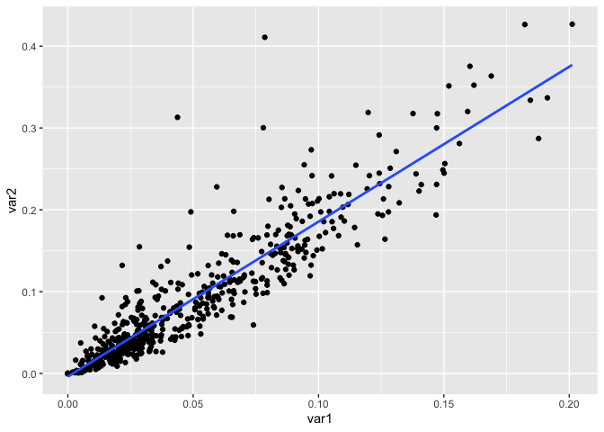

<!-- README.md is generated from README.Rmd. Please edit that file -->

# lm.fit.and.graph

<!-- badges: start -->
<!-- badges: end -->

The goal of the lm.fit.and.graph package is to summarize and plot the
linear relationship between 2 variables in a data set. It provides a
linear model and a scatter plot fitted to the 2 variables that the user
can specify.

## Installation

The current function is not yet available on CRAN.

The development version from [GitHub](https://github.com/) with:

``` r
# install.packages("devtools")
devtools::install_github("stat545ubc-2021/functions-britttheuser")
```

## Example

The following is an example application package using 2 variables
(concave points mean and concavity mean) from the Cancer sample dataset.

``` r
library(lm.fit.and.graph)
correlation_lm_and_plot(datateachr::cancer_sample, datateachr::cancer_sample$concave_points_mean, datateachr::cancer_sample$concavity_mean)
#> [[1]]
#> 
#> Call:
#> stats::lm(formula = var1 ~ var2, data = data)
#> 
#> Residuals:
#>       Min        1Q    Median        3Q       Max 
#> -0.114759 -0.006785 -0.000398  0.007817  0.050935 
#> 
#> Coefficients:
#>              Estimate Std. Error t value Pr(>|t|)    
#> (Intercept) 0.0090946  0.0009476   9.597   <2e-16 ***
#> var2        0.4484782  0.0079442  56.454   <2e-16 ***
#> ---
#> Signif. codes:  0 '***' 0.001 '**' 0.01 '*' 0.05 '.' 0.1 ' ' 1
#> 
#> Residual standard error: 0.01509 on 567 degrees of freedom
#> Multiple R-squared:  0.849,  Adjusted R-squared:  0.8487 
#> F-statistic:  3187 on 1 and 567 DF,  p-value: < 2.2e-16
#> 
#> 
#> [[2]]
#> `geom_smooth()` using formula 'y ~ x'
```


